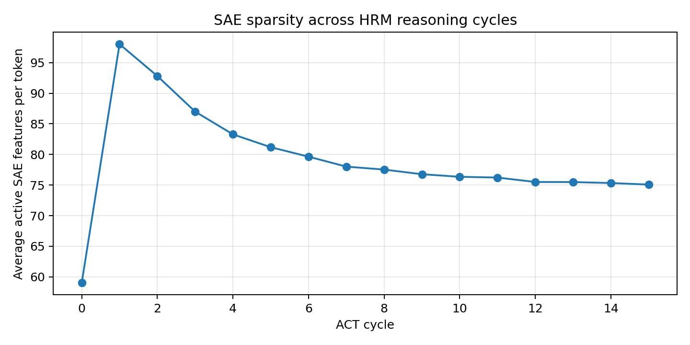
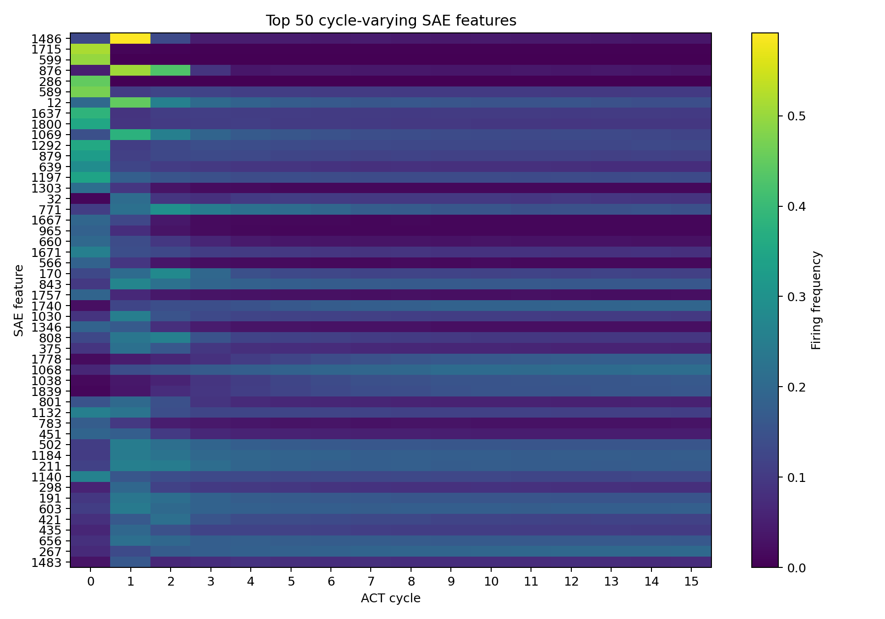
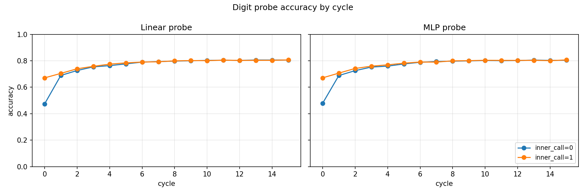
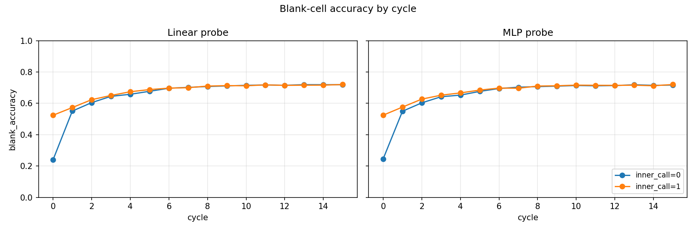

# Probing HRM

> **A fork of the [Hierarchical Reasoning Model (HRM)](https://github.com/sapientinc/HRM).**
> This fork adds mechanistic-interpretability experiments on top of the original
> training code: it probes the hidden-state trajectories of a pre-trained HRM as it
> solves Sudoku, using autoencoders and lightweight classifiers. 

## What this fork adds

Given a trained HRM checkpoint solving Sudoku-Extreme, the goal is to understand
what the model's high-level (H-level) hidden states represent across its
reasoning cycles:

- **Extract** H-level residual-stream activations with PyTorch forward hooks
  (no changes to the HRM model itself, see `probing_analysis.py`).
- **Compress** them with two autoencoders (an Undercomplete Autoencoder (UAE)
  and a Sparse Autoencoder (SAE)) to find low-dimensional / sparse structure.
- **Test** whether the raw, UAE, and SAE embeddings still carry information about
  which reasoning (ACT) cycle the model is in, and which SAE features fire on
  which cycle.

All probing code lives in `probing/`:

| Script | Purpose |
| --- | --- |
| `probing/probing_analysis.py` | Extract hidden states via forward hooks. |
| `probing/train_uae_cluster.py` | Train the undercomplete autoencoder. |
| `probing/train_sae_cluster.py` | Train the sparse autoencoder. |
| `probing/classify_cycle_embeddings.py` | Test whether raw/UAE/SAE embeddings predict the ACT cycle. |
| `probing/analyze_sae_cycles.py` | Compute SAE feature activity per ACT cycle. |
| `probing/probing_sudoku_structured.py` | Structured extractor for cell-level Sudoku probes. |
| `probing/train_sudoku_probe.py` | Train cell→digit probes from structured activations. |

## Results

### SAE sparsity across reasoning cycles

The H-level SAE shows a spike at cycle 1 (~98 active features/token) followed
by strictly monotonic decrease down to ~75 active features/token. (Note: During these experiments the Q-Head responsible for early stopping was disabled)



### Cycle-specific SAE features

Top 50 most cycle-varying features. A cluster of features fires almost exclusively at cycles 0–2 and then goes silent, other features are almost indistinct.



### Digit probe accuracy across cycles

Linear and MLP probes trained on H-level activations to predict the solved digit at
each cell. Overall accuracy (given + blank) reaches ~80% by cycle 15.



The stricter measure is blank-cell accuracy, on cells the model actually had to
infer. These rise from ~24% at cycle 0 to ~72% by cycle 15, confirming that the
H-state progressively encodes the solution rather than just memorising the input.



The rest of the result figures and metrics live under `results/`. Trained weights and raw
activation dumps are not committed, but feel free to rerun
the scripts to regenerate them.

---

# Hierarchical Reasoning Model


Reasoning, the process of devising and executing complex goal-oriented action sequences, remains a critical challenge in AI.
Current large language models (LLMs) primarily employ Chain-of-Thought (CoT) techniques, which suffer from brittle task decomposition, extensive data requirements, and high latency. Inspired by the hierarchical and multi-timescale processing in the human brain, we propose the Hierarchical Reasoning Model (HRM), a novel recurrent architecture that attains significant computational depth while maintaining both training stability and efficiency.
HRM executes sequential reasoning tasks in a single forward pass without explicit supervision of the intermediate process, through two interdependent recurrent modules: a high-level module responsible for slow, abstract planning, and a low-level module handling rapid, detailed computations. With only 27 million parameters, HRM achieves exceptional performance on complex reasoning tasks using only 1000 training samples. The model operates without pre-training or CoT data, yet achieves nearly perfect performance on challenging tasks including complex Sudoku puzzles and optimal path finding in large mazes.
Furthermore, HRM outperforms much larger models with significantly longer context windows on the Abstraction and Reasoning Corpus (ARC), a key benchmark for measuring artificial general intelligence capabilities.
These results underscore HRM’s potential as a transformative advancement toward universal computation and general-purpose reasoning systems.

Read Our Paper: [https://arxiv.org/abs/2506.21734](https://arxiv.org/abs/2506.21734)

**Join Our Discord Community: [https://discord.gg/sapient](https://discord.gg/sapient)**


## Quick Start Guide 🚀

### Prerequisites ⚙️

Ensure PyTorch and CUDA are installed. The repo needs CUDA extensions to be built. If not present, run the following commands:

```bash
# Install CUDA 12.6
CUDA_URL=https://developer.download.nvidia.com/compute/cuda/12.6.3/local_installers/cuda_12.6.3_560.35.05_linux.run

wget -q --show-progress --progress=bar:force:noscroll -O cuda_installer.run $CUDA_URL
sudo sh cuda_installer.run --silent --toolkit --override

export CUDA_HOME=/usr/local/cuda-12.6

# Install PyTorch with CUDA 12.6
PYTORCH_INDEX_URL=https://download.pytorch.org/whl/cu126

pip3 install torch torchvision torchaudio --index-url $PYTORCH_INDEX_URL

# Additional packages for building extensions
pip3 install packaging ninja wheel setuptools setuptools-scm
```

FlashAttention is **optional in this fork** — it falls back to PyTorch's native
attention . Install it only if you
want the original kernels. For Hopper GPUs, install FlashAttention 3:

```bash
git clone git@github.com:Dao-AILab/flash-attention.git
cd flash-attention/hopper
python setup.py install
```

For Ampere or earlier GPUs, install FlashAttention 2

```bash
pip3 install flash-attn
```

---

This is a research fork. For the original HRM training/evaluation instructions
(W&B setup, dataset preparation, full-scale experiments, evaluation) and the
paper citation, see the upstream repository:

- **Original code:** https://github.com/sapientinc/HRM
- **Paper:** https://arxiv.org/abs/2506.21734
